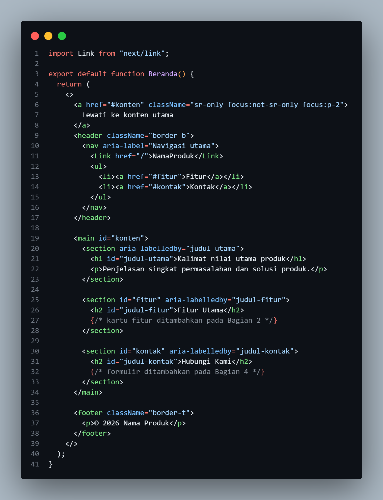
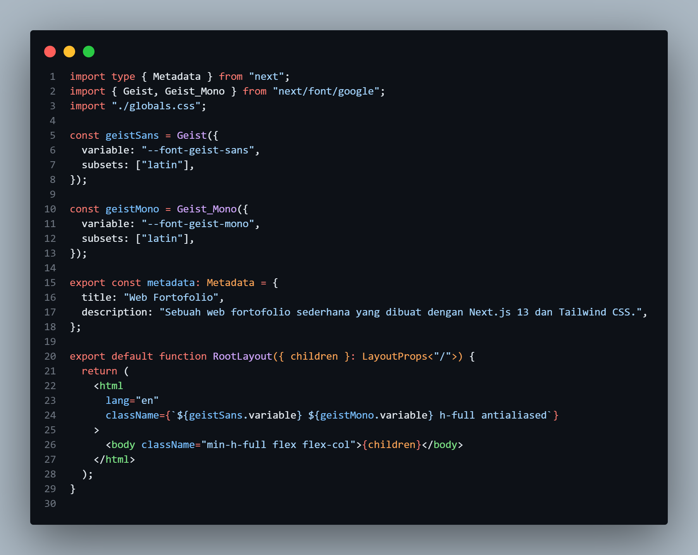
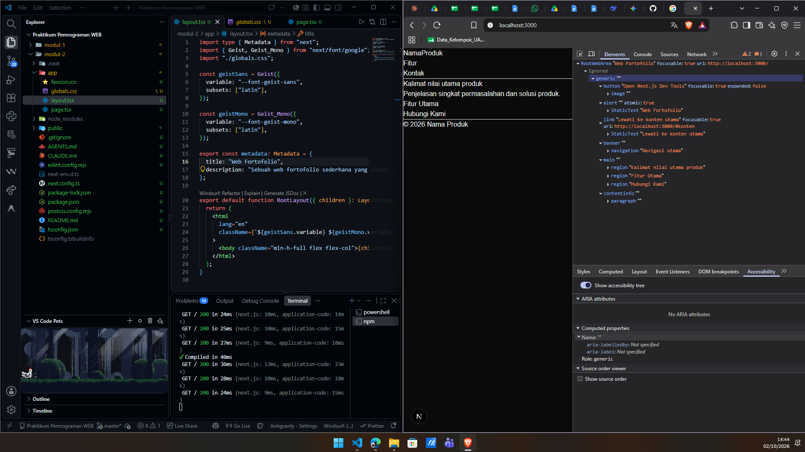
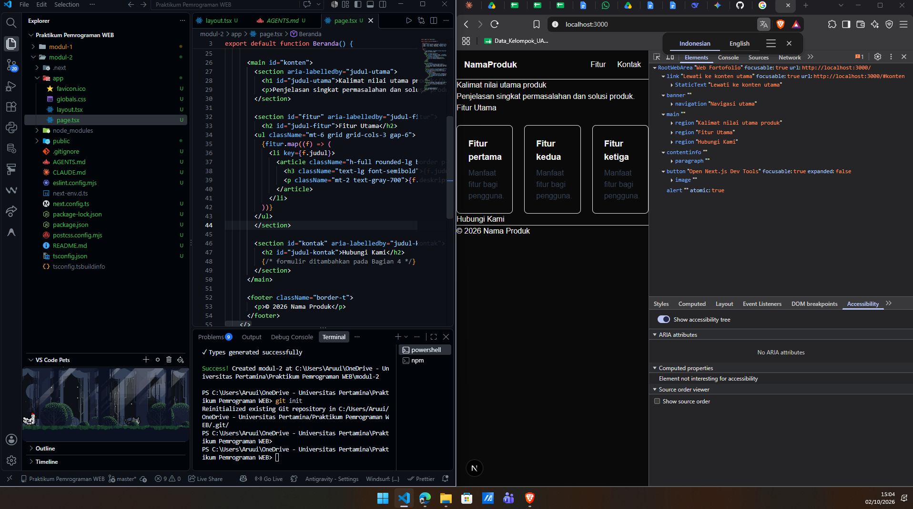
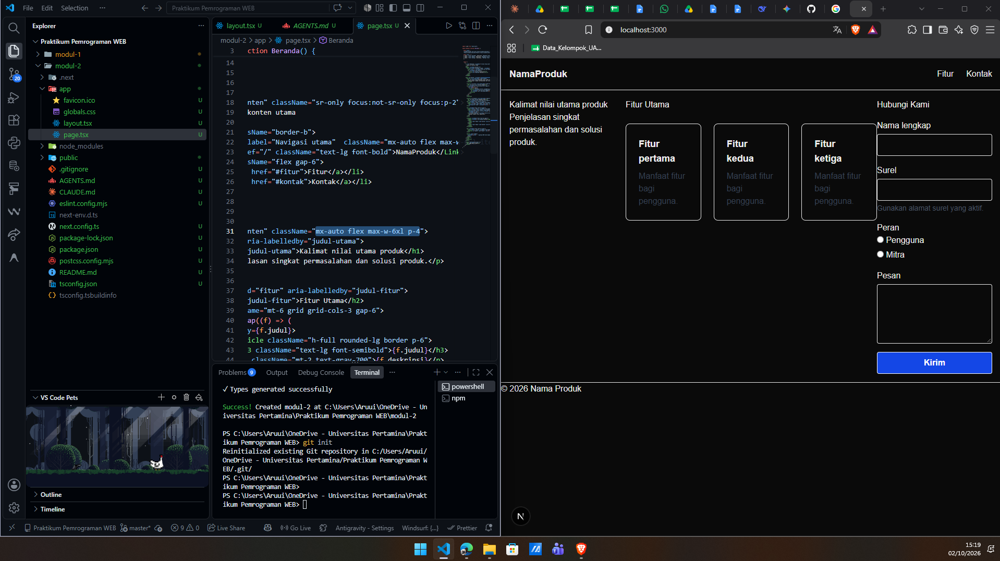
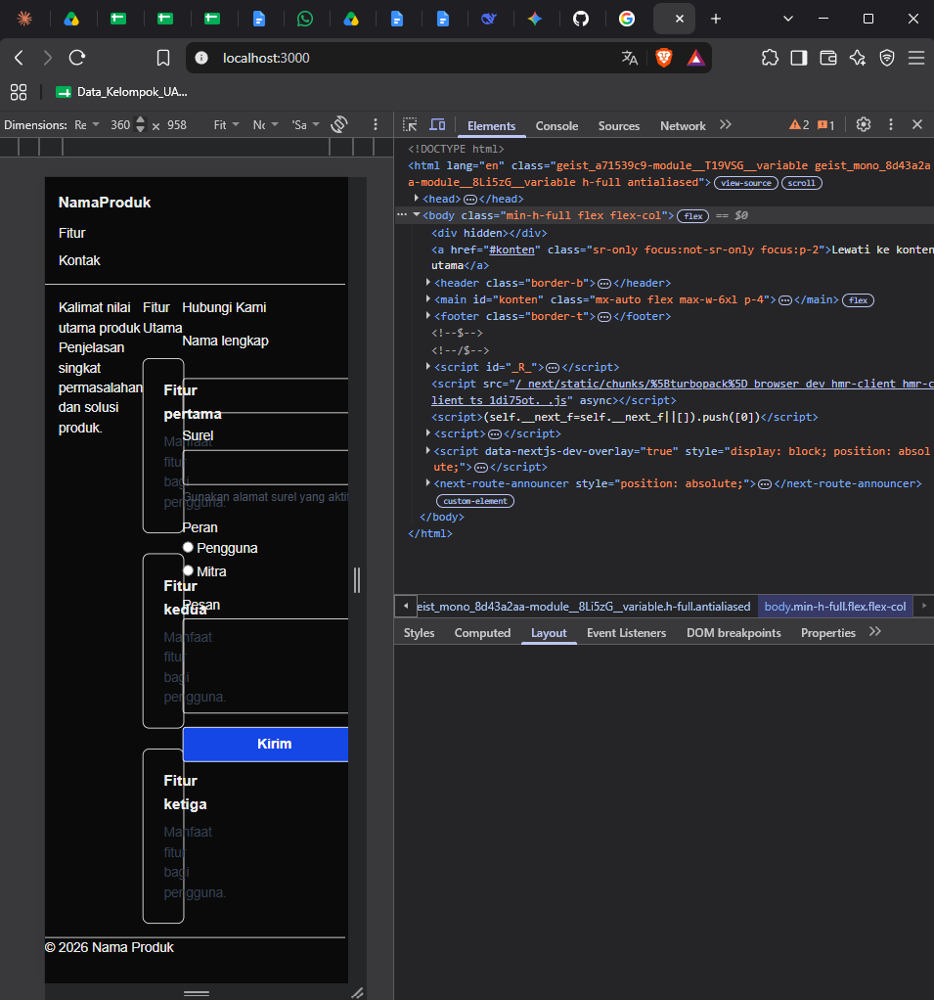
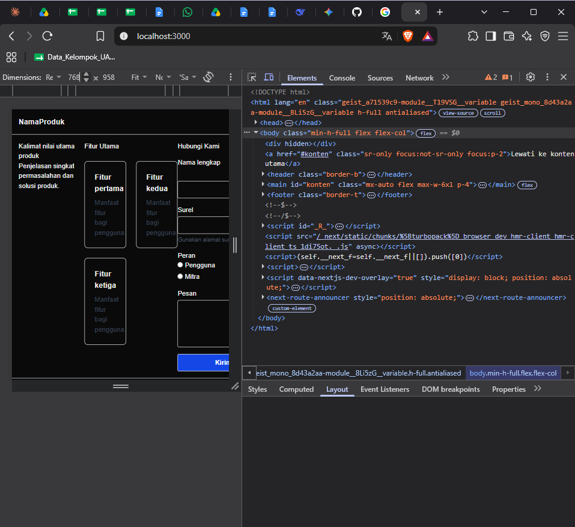
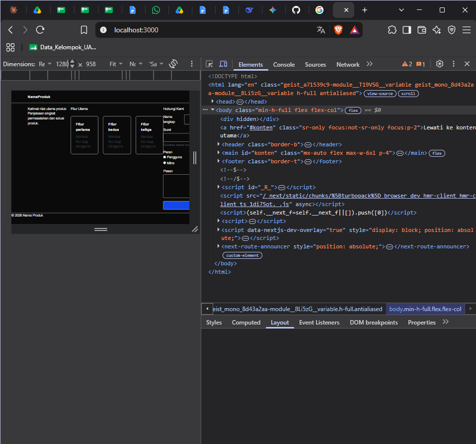
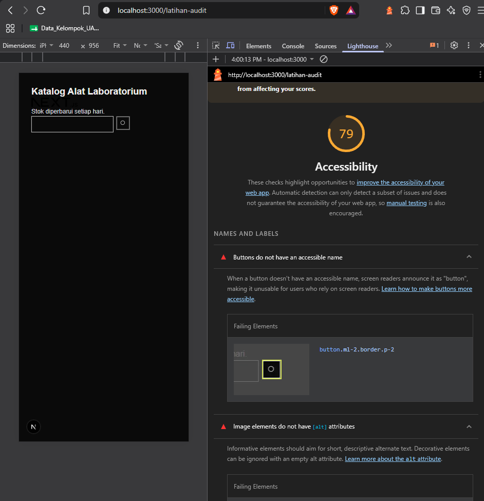

# Dokumen Teknis Modul 2 — HTML Semantik, Tailwind CSS, dan Aksesibilitas

Nama/NIM   : [ISI NAMA] / [ISI NIM]
Repositori : [ISI TAUTAN REPOSITORI GITHUB]

---

## 1. Struktur Semantik

Bagian ini membahas hasil Bagian 1 praktikum, yaitu penyusunan kerangka halaman utama produk dengan elemen HTML semantik. Elemen semantik dipilih karena maknanya dapat dibaca oleh peramban, mesin pencari, dan teknologi bantu seperti pembaca layar, berbeda dengan `
` yang tidak memiliki makna [2]. Sebagian elemen semantik juga dipetakan ke peran *landmark* ARIA sehingga pengguna pembaca layar dapat berpindah langsung ke bagian tertentu halaman [6].

### 1.1 Kerangka Landmark dan Hierarki Judul Halaman Utama

Kerangka halaman ditulis pada berkas `app/page.tsx` dan ditunjukkan pada Gambar 1.

**Gambar 1.** Kode kerangka semantik halaman utama (`app/page.tsx`).

Gambar 1 memperlihatkan komponen `Beranda` yang tersusun dari empat bagian utama:

1. **Tautan lompat (*skip link*)** pada baris 6–8, yaitu `<a href="#konten" className="sr-only focus:not-sr-only focus:p-2">`. Kelas `sr-only` menyembunyikan tautan secara visual, sedangkan `focus:not-sr-only` memunculkannya ketika menerima fokus papan ketik. Dengan tautan ini, pengguna papan ketik dapat melewati navigasi dan langsung menuju konten utama.
2. **`<header>` dan `<nav>`** pada baris 9–17. Elemen `<nav>` diberi `aria-label="Navigasi utama"` agar *landmark* navigasi memiliki nama. Tautan ke halaman lain di dalam aplikasi memakai komponen `Link` dari `next/link`, sedangkan tautan ke bagian pada halaman yang sama cukup memakai `<a href="#...">`.
3. **`<main id="konten">`** pada baris 19–34 yang memuat tiga `<section>`, yaitu bagian utama (`judul-utama`), bagian fitur (`judul-fitur`), dan bagian kontak (`judul-kontak`). Setiap `<section>` memakai atribut `aria-labelledby` yang merujuk ke `id` judulnya. Atribut ini penting karena `<section>` baru menjadi *landmark* `region` apabila memiliki nama yang dapat diakses [6].
4. **`<footer>`** pada baris 36–38 yang berisi informasi hak cipta.

Hierarki judul pada halaman ini adalah sebagai berikut.

| Tingkat | Elemen | Teks | Keterangan |
|---|---|---|---|
| 1 | `<h1 id="judul-utama">` | Kalimat nilai utama produk | Satu-satunya `<h1>` pada halaman |
| 2 | `<h2 id="judul-fitur">` | Fitur Utama | Judul *section* fitur |
| 3 | `<h3>` | Fitur pertama, Fitur kedua, Fitur ketiga | Judul kartu fitur (ditambahkan pada Bagian 2) |
| 2 | `<h2 id="judul-kontak">` | Hubungi Kami | Judul *section* kontak |

Hierarki ini runtut dari `<h1>` ke `<h2>` lalu `<h3>` tanpa melompat tingkat, sesuai anjuran pada modul. Halaman juga hanya memiliki satu `<main>`.

Selain `page.tsx`, praktikum ini juga mengubah `app/layout.tsx` yang ditunjukkan pada Gambar 2.

**Gambar 2.** Isi berkas `app/layout.tsx` yang memuat metadata dan elemen `<html>`.

Pada Gambar 2, objek `metadata` berisi `title` dan `description` halaman. Atribut `title` tampil pada tab peramban dan hasil mesin pencari, sedangkan atribut `lang` pada elemen `<html>` menentukan cara pembaca layar melafalkan teks [10]. Elemen `<body>` memakai kelas `min-h-full flex flex-col` sehingga `<footer>` dapat berada di bagian bawah halaman. Catatan mengenai nilai `lang` pada tangkapan layar ini dibahas pada Bagian 4.

### 1.2 Tangkapan Layar Pohon Aksesibilitas pada DevTools

Pohon aksesibilitas diperiksa melalui panel **Elements → Accessibility** dengan opsi *Show accessibility tree* aktif. Hasilnya ditunjukkan pada Gambar 3.

**Gambar 3.** Pohon aksesibilitas halaman utama pada DevTools (sisi kanan) berdampingan dengan kode `layout.tsx` di VS Code (sisi kiri).

Pohon aksesibilitas pada Gambar 3 memperlihatkan *landmark* berikut.

| *Landmark* | Elemen HTML | Nama yang terbaca |
|---|---|---|
| `link` | `<a href="#konten">` | "Lewati ke konten utama" |
| `banner` | `<header>` | (berisi `navigation` "Navigasi utama") |
| `navigation` | `<nav>` | "Navigasi utama" |
| `main` | `<main>` | (berisi tiga `region`) |
| `region` | `<section>` | "Kalimat nilai utama produk", "Fitur Utama", "Hubungi Kami" |
| `contentinfo` | `<footer>` | (berisi paragraf hak cipta) |

Seluruh *landmark* yang diminta pada Langkah 3 Bagian 1 modul, yaitu *banner*, *navigation*, *main*, *region*, dan *contentinfo*, sudah muncul. Nama ketiga `region` sama dengan teks judul masing-masing *section*. Hal ini menunjukkan bahwa `aria-labelledby` bekerja dengan benar. Hasil ini memenuhi **Checkpoint 1**: halaman memiliki satu `<h1>`, judul `<h2>` untuk setiap *section*, satu `<main>`, dan *landmark* yang lengkap.

---

## 2. Tata Letak Responsif

Bagian ini membahas hasil Bagian 2 dan Bagian 3 praktikum, yaitu penataan letak dengan Flexbox dan Grid, lalu penyesuaian tampilan pada tiga ukuran layar dengan pendekatan *mobile-first*.

### 2.1 Penataan Letak dengan Flexbox dan Grid

Navigasi ditata dengan Flexbox, sedangkan kartu fitur ditata dengan Grid. Hasilnya ditunjukkan pada Gambar 4.

**Gambar 4.** Hasil penataan navigasi (Flexbox) dan kartu fitur (Grid) beserta kodenya di VS Code.

Pada Gambar 4, logo "NamaProduk" berada di sisi kiri dan menu "Fitur" serta "Kontak" berada di sisi kanan dalam satu baris. Di bawahnya, tiga kartu fitur tampil sejajar dalam tiga kolom. Kode pada panel kiri memperlihatkan data `fitur` yang dipetakan dengan `fitur.map(...)` menjadi satu `<article>` untuk setiap data. Atribut `key={f.judul}` diperlukan agar React dapat mengenali setiap elemen daftar.

Hasil penataan pada tampilan desktop secara utuh, termasuk formulir pada bagian kontak, ditunjukkan pada Gambar 5.

**Gambar 5.** Tampilan desktop halaman utama. Kode yang disorot pada VS Code adalah kelas `mx-auto flex max-w-6xl p-4` pada elemen `<main>`.

Pada Gambar 5, tiga bagian dalam `<main>` (kalimat nilai utama, fitur, dan kontak) tampil berdampingan karena `<main>` diberi kelas `flex`. Pada layar lebar, tampilan ini memenuhi **Checkpoint 2**: navigasi tersusun mendatar, kartu fitur tampil dalam tiga kolom, dan konten tampil berdampingan.

**Kelas Flexbox, Grid, dan *breakpoint* yang digunakan beserta alasannya**

| Bagian | Kelas utama | Alasan pemilihan |
|---|---|---|
| Navigasi `<nav>` | `mx-auto flex max-w-6xl flex-col gap-3 p-4 sm:flex-row sm:items-center sm:justify-between` | Navigasi hanya perlu ditata pada **satu dimensi** (satu baris berisi logo dan menu), sehingga Flexbox lebih tepat. `justify-between` memisahkan logo ke kiri dan menu ke kanan, sedangkan `items-center` meratakan keduanya di tengah sumbu silang [3]. |
| Daftar menu `<ul>` | `flex flex-col gap-2 sm:flex-row sm:gap-6` | Menu bertumpuk di ponsel dan mendatar mulai 640 px. |
| Kartu fitur `<ul>` | `mt-6 grid grid-cols-1 gap-6 sm:grid-cols-2 lg:grid-cols-3` | Kumpulan kartu tersusun dalam **baris dan kolom sekaligus**, sehingga Grid lebih tepat [3]. Jumlah kolom bertambah sesuai lebar layar. |
| Kartu `<article>` | `h-full rounded-lg border p-6` | `h-full` menyamakan tinggi kartu dalam satu baris. |
| Isi `<main>` | `mx-auto flex max-w-6xl p-4` | `max-w-6xl` dan `mx-auto` membatasi lebar konten dan meletakkannya di tengah agar tidak terlalu melebar pada layar besar. |
| Formulir `<form>` | `mt-4 grid max-w-xl gap-4` | Grid satu kolom memberi jarak seragam antarkolom isian. |

Prinsip pemilihannya adalah Flexbox digunakan untuk susunan satu dimensi (navigasi dan kelompok isian), sedangkan Grid digunakan untuk susunan dua dimensi (kumpulan kartu).

### 2.2 Tangkapan Layar pada Lebar 360 px, 768 px, dan 1280 px

Tangkapan layar diambil melalui *Device Toolbar* pada DevTools (Ctrl + Shift + M) dengan lebar masing-masing 360 px, 768 px, dan 1280 px [8].

**a. Lebar 360 px (ponsel)**

**Gambar 6.** Tampilan halaman utama pada lebar 360 px.

Pada lebar 360 px, navigasi sudah bertumpuk ke bawah (logo, lalu "Fitur", lalu "Kontak") karena kelas `flex-col` berlaku tanpa awalan. Kartu fitur tampil satu kolom sesuai `grid-cols-1`. Namun, ruang yang sempit membuat bagian-bagian di dalam `<main>` saling berdesakan dan sebagian teks serta kartu tampak tumpang tindih. Penyebabnya adalah `<main>` masih berkelas `flex` (baris) tanpa awalan *breakpoint*. Pembahasan dan usulan perbaikannya ada pada Bagian 4.

**b. Lebar 768 px (tablet)**

**Gambar 7.** Tampilan halaman utama pada lebar 768 px.

Pada lebar 768 px, lebar layar sudah melewati *breakpoint* `sm` (640 px) sehingga navigasi tampil mendatar (`sm:flex-row`) dan kartu fitur tampil dua kolom (`sm:grid-cols-2`). Kartu ketiga turun ke baris berikutnya. Hal ini sesuai dengan ilustrasi perubahan jumlah kolom pada pendekatan *mobile-first* [4]. Bagian formulir terlihat terpotong di sisi kanan karena ruang yang tersedia untuk bagian kontak sempit.

**c. Lebar 1280 px (desktop)**

**Gambar 8.** Tampilan halaman utama pada lebar 1280 px.

Pada lebar 1280 px, lebar layar melewati *breakpoint* `lg` (1024 px) sehingga kartu fitur tampil tiga kolom (`lg:grid-cols-3`). Konten dibatasi `max-w-6xl` dan diletakkan di tengah dengan `mx-auto`. Seluruh bagian halaman muat dalam satu layar dan tidak terdapat gulir horizontal.

**Ringkasan penggunaan *breakpoint***

| Lebar layar | Awalan | Perilaku yang diterapkan |
|---|---|---|
| < 640 px | (tanpa awalan) | Navigasi bertumpuk (`flex-col`), kartu 1 kolom (`grid-cols-1`) |
| ≥ 640 px | `sm:` | Navigasi mendatar (`sm:flex-row`), kartu 2 kolom (`sm:grid-cols-2`) |
| ≥ 1024 px | `lg:` | Kartu 3 kolom (`lg:grid-cols-3`) |

Pendekatan *mobile-first* digunakan karena Tailwind CSS menerapkan kelas tanpa awalan untuk semua ukuran layar, sedangkan kelas berawalan *breakpoint* seperti `sm:` berlaku mulai lebar tersebut ke atas [4]. Dengan demikian, tampilan ponsel ditulis lebih dahulu, lalu disesuaikan untuk layar yang lebih lebar. Kondisi pada Gambar 6 sampai Gambar 8 menjadi bukti **Checkpoint 3**, yaitu jumlah kolom kartu berubah sesuai *breakpoint*.

### 2.3 Formulir Kontak

Formulir pada bagian "Hubungi Kami" terlihat pada Gambar 5 dan terdiri atas kolom *Nama lengkap*, *Surel* beserta petunjuknya ("Gunakan alamat surel yang aktif."), pilihan *Peran* (Pengguna dan Mitra), kolom *Pesan*, dan tombol *Kirim*. Pembahasan aksesibilitas formulir ini ada pada Bagian 3.

---

## 3. Audit Aksesibilitas

Bagian ini membahas hasil Bagian 4 dan Bagian 5 praktikum, yaitu penerapan formulir yang aksesibel dan audit aksesibilitas dengan Lighthouse. Acuan yang digunakan adalah WCAG 2.2 [5]. Skor aksesibilitas Lighthouse dihitung dari audit otomatis berbasis axe-core, dan setiap audit bernilai lulus atau gagal tanpa nilai parsial [7].

### 3.1 Unsur Aksesibilitas pada Formulir

Unsur aksesibilitas yang diterapkan pada formulir kontak adalah sebagai berikut.

| Unsur | Penerapan pada formulir | Fungsi |
|---|---|---|
| Konstanta `kolom` | `className={kolom}` pada `input` dan `textarea` | Menyimpan kelas yang sama agar tidak ditulis berulang |
| `<label htmlFor>` | `htmlFor="nama"`, `"email"`, `"pesan"` | Menghubungkan label dengan kolom isian; mengeklik label memindahkan fokus ke kolom |
| `aria-describedby` | Kolom surel merujuk ke `email-bantuan` | Teks petunjuk dibacakan setelah label ketika kolom menerima fokus |
| `<fieldset>` dan `<legend>` | Pilihan radio "Peran" | Mengelompokkan radio dan memberi nama kelompok |
| `autoComplete` | `name` dan `email` | Membantu peramban mengisi data yang umum |
| `focus-visible:outline-*` | Bagian dari konstanta `kolom` | Menampilkan garis fokus yang jelas saat navigasi papan ketik |

Elemen interaktif memakai `<input>`, `<textarea>`, dan `<button type="submit">` yang memang dapat difokuskan oleh papan ketik, bukan `
` yang dapat diklik (WCAG 2.1.1). Dengan demikian, **Checkpoint 4** terpenuhi pada sisi struktur: setiap kolom memiliki label yang terhubung dan pilihan radio dikelompokkan dengan `<legend>`.

### 3.2 Tabel Skor Lighthouse Sebelum dan Sesudah Perbaikan

Audit dijalankan dengan mode *Navigation*, perangkat *Mobile*, dan kategori *Accessibility* saja. Hasil audit awal pada halaman latihan ditunjukkan pada Gambar 9.

**Gambar 9.** Skor aksesibilitas Lighthouse pada halaman latihan (`/latihan-audit`) sebelum perbaikan.

Pada Gambar 9, halaman latihan memperoleh skor **79**. Dua audit yang gagal dan terlihat pada tangkapan layar adalah *Buttons do not have an accessible name* (elemen `button.ml-2.border.p-2`) dan *Image elements do not have [alt] attributes*.

**Tabel skor Lighthouse**

| Halaman | Sebelum perbaikan | Sesudah perbaikan | Target |
|---|---|---|---|
| Halaman latihan (`/latihan-audit`) | 79 | [ISI SKOR] | ≥ 90 |
| Halaman utama (`/`) | [ISI SKOR] | [ISI SKOR] | ≥ 85 |

> Catatan: skor sesudah perbaikan dan skor halaman utama diisi sesuai hasil audit pada komputer masing-masing, lalu tangkapan layarnya ditambahkan pada folder `gambar/`.

### 3.3 Daftar Audit yang Gagal, Penyebab, dan Perbaikannya

Halaman latihan sengaja dibuat memuat beberapa masalah aksesibilitas. Daftar temuan dan perbaikannya mengikuti Tabel 5 pada modul.

| No | Audit yang gagal | Penyebab pada kode | Perbaikan |
|---|---|---|---|
| 1 | *Image elements do not have [alt] attributes* | `` tanpa atribut `alt` (melanggar WCAG 1.1.1) | Menambahkan `alt` yang menjelaskan isi gambar, atau `alt=""` bila gambar hanya dekoratif |
| 2 | *Background and foreground colors do not have a sufficient contrast ratio* | Paragraf berkelas `text-gray-300` berwarna abu-abu muda sehingga rasio kontras kurang dari 4,5:1 (WCAG 1.4.3) | Mengganti dengan warna lebih gelap, misalnya `text-gray-700` |
| 3 | *Form elements do not have associated labels* | `<input type="search">` tidak memiliki label | Menambahkan `<label htmlFor>` yang terlihat, misalnya "Cari alat" |
| 4 | *Buttons do not have an accessible name* | `<button>` hanya berisi ikon SVG sehingga pembaca layar hanya membacakan "button" (WCAG 4.1.2) | Menambahkan `aria-label="Cari"` pada tombol dan `aria-hidden="true"` pada ikon SVG |

Selain empat temuan di atas, terdapat dua masalah yang tidak tercatat sebagai audit gagal oleh Lighthouse, tetapi terlihat pada pemeriksaan manual pohon aksesibilitas.

1. **Judul halaman ditulis dengan `
`.** Teks "Katalog Alat Laboratorium" perlu diganti dengan `<h1>` agar struktur judul dapat dikenali secara terprogram (WCAG 1.3.1).
2. ***Placeholder* tidak menggantikan label.** Alat audit otomatis dapat menerima *placeholder* sebagai nama kolom, padahal teks tersebut hilang ketika pengguna mulai mengetik dan sering berkontras rendah. Oleh karena itu, label yang terlihat tetap diperlukan.

Setelah perbaikan, folder `app/latihan-audit` dihapus karena halaman tersebut bukan bagian dari produk.

### 3.4 Hasil Pemeriksaan Manual dengan Papan Ketik (Urutan Fokus dan Garis Fokus)

Pemeriksaan manual diperlukan karena sebagian masalah, seperti urutan fokus yang tidak logis, hanya dapat ditemukan melalui pemeriksaan manual [7]. Pengujian dilakukan hanya dengan papan ketik: **Tab** untuk berpindah, **Shift + Tab** untuk kembali, **Spasi** untuk memilih radio, dan **Enter** untuk mengirim.

Urutan fokus yang diharapkan pada halaman utama adalah sebagai berikut.

| Urutan | Elemen yang difokuskan | Hasil |
|---|---|---|
| 1 | Tautan "Lewati ke konten utama" (muncul saat fokus) | [ISI: Sesuai / Tidak sesuai] |
| 2 | Tautan logo "NamaProduk" | [ISI] |
| 3 | Tautan menu "Fitur" | [ISI] |
| 4 | Tautan menu "Kontak" | [ISI] |
| 5 | Kolom "Nama lengkap" | [ISI] |
| 6 | Kolom "Surel" | [ISI] |
| 7 | Pilihan radio "Pengguna" dan "Mitra" | [ISI] |
| 8 | Kolom "Pesan" | [ISI] |
| 9 | Tombol "Kirim" | [ISI] |

Poin yang diperiksa dan dicatat:

- Urutan fokus mengikuti urutan visual dari kiri ke kanan dan dari atas ke bawah: [ISI]
- Garis fokus (`focus-visible:outline-*`) selalu terlihat pada setiap elemen interaktif: [ISI]
- Tautan lompat muncul saat menerima fokus pertama dan berfungsi memindahkan fokus ke `<main>`: [ISI]
- Formulir dapat dikirim dengan tombol Enter: [ISI]

---

## 4. Kendala dan Penyelesaian

Selama praktikum, beberapa kendala ditemukan dari hasil tangkapan layar dan diselesaikan atau dicatat sebagai berikut.

| No | Kendala | Penyebab | Penyelesaian |
|---|---|---|---|
| 1 | Tampilan 360 px berdesakan dan sebagian kartu serta formulir tampak tumpang tindih (Gambar 6) | Elemen `<main>` berkelas `flex` (arah baris) tanpa awalan *breakpoint*, sehingga tiga *section* dipaksa berjajar pada layar sempit. Hal ini sejalan dengan penyebab "tata letak multikolom tanpa awalan *breakpoint*" pada tabel *troubleshooting* modul. | Mengubah arah *flex* menjadi *mobile-first*, yaitu `flex-col` untuk ponsel dan `lg:flex-row` untuk layar lebar, atau memakai Grid dengan `grid-cols-1 lg:grid-cols-[...]` seperti pada langkah modul. |
| 2 | Atribut `lang` pada `<html>` masih bernilai `en` dan judul halaman masih "Web Fortofolio" pada tangkapan layar (Gambar 2 dan Gambar 3) | Langkah 1 Bagian 1 belum diterapkan seluruhnya pada saat tangkapan layar diambil. Peramban bahkan menawarkan terjemahan "Indonesian/English" karena bahasa halaman terbaca bahasa Inggris. | Mengubah menjadi `<html lang="id">` dan mengisi `title` serta `description` sesuai produk. |
| 3 | Peringatan ESLint `@next/next/no-img-element` pada halaman latihan | Penggunaan `` alih-alih komponen `Image` dari Next.js | Peringatan diabaikan pada halaman latihan karena halaman tersebut dihapus; pada halaman produk digunakan `Image` dari `next/image`. |
| 4 | Skor Lighthouse dapat berubah-ubah | Pengaruh ekstensi peramban | Audit dijalankan pada jendela Incognito/InPrivate. |

---

## 5. Catatan Pemanfaatan AI

- **Alat:** Claude (Anthropic).
- **Perintah utama:** meminta penyusunan draf Dokumen Teknis Modul 2 berdasarkan modul praktikum dan tangkapan layar hasil praktikum, dengan bahasa yang sesuai untuk mahasiswa dan pembahasan yang berurutan mengikuti modul.
- **Bagian yang digunakan:** penyusunan kalimat penjelasan untuk setiap gambar, tabel kelas Tailwind CSS beserta alasannya, serta tabel audit aksesibilitas pada Bagian 1 sampai Bagian 4 dokumen ini.
- **Cara memverifikasi:** isi penjelasan dicocokkan dengan modul praktikum dan dokumentasi resmi Tailwind CSS [4], MDN [2][3], WCAG 2.2 [5], dan Lighthouse [7]. Setiap kelas dan elemen pada kode dibaca ulang, hasil tampilan dibandingkan dengan tangkapan layar, dan angka skor Lighthouse serta hasil uji papan ketik diisi dari hasil pengujian sendiri. [SESUAIKAN DENGAN PROSES VERIFIKASI YANG BENAR-BENAR DILAKUKAN]

---

## Daftar Pustaka

[2] Mozilla. (2026). HTML elements reference. *MDN Web Docs*. https://developer.mozilla.org/en-US/docs/Web/HTML/Element

[3] Mozilla. (2026). CSS layout: Flexbox dan Grids. *MDN Web Docs*. https://developer.mozilla.org/en-US/docs/Learn_web_development/Core/CSS_layout

[4] Tailwind Labs. (2026). Responsive design dan Theme variables. *Tailwind CSS Documentation*. https://tailwindcss.com/docs/responsive-design

[5] World Wide Web Consortium. (2023). *Web Content Accessibility Guidelines (WCAG) 2.2*. https://www.w3.org/TR/WCAG22/

[6] W3C Web Accessibility Initiative. (2024). Landmark regions. *ARIA Authoring Practices Guide*. https://www.w3.org/WAI/ARIA/apg/practices/landmark-regions/

[7] Google. (2026). Lighthouse accessibility score. *Chrome for Developers*. https://developer.chrome.com/docs/lighthouse/accessibility/scoring

[8] Google. (2026). Simulate mobile devices with device mode dan Accessibility features reference. *Chrome for Developers*. https://developer.chrome.com/docs/devtools/device-mode

[10] Vercel. (2026). Metadata and OG images. *Next.js Documentation*. https://nextjs.org/docs/app/getting-started/metadata-and-og-images
